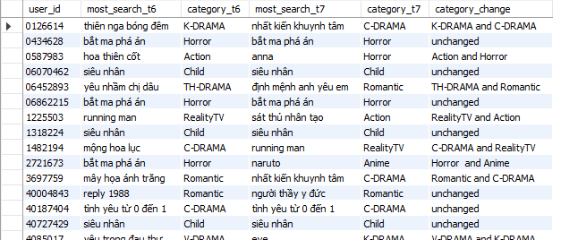
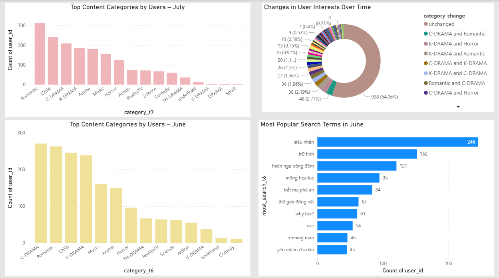

# 🚀 Big Data User Search Behavior Analysis with PySpark & Power BI

## 📌 Project Overview

This project demonstrates a **Big Data ETL pipeline** that analyzes user search behavior over time using **Apache Spark**. The system processes **massive Parquet-based log files**, extracts insights on user interests, and tracks how these interests change between months. The final data is stored in **MySQL** and visualized via **Power BI dashboards**.

> 💡 The project simulates a real-world data lake scenario where search logs are ingested, cleaned, transformed, and visualized to support **behavioral analysis and business decisions**.

---

## 🧱 Tech Stack & Tools

| Layer         | Technology                     |
|---------------|--------------------------------|
| Data Storage  | Parquet (search logs), CSV     |
| Processing    | PySpark (on Apache Spark)      |
| Storage       | MySQL                          |
| Visualization | Power BI                       |
| Language      | Python                         |
| Others        | Pandas, JDBC                   |

---

## 📂 Input Data

- **Search Logs**: Stored in Parquet format per day  
  ➤ Path: `E:/bigdata/Dataset/log_search/Total_File/YYYYMMDD.parquet`
- **Keyword-Category Mapping**: CSV file  
  ➤ Path: `key_search_by_category.csv`

Each log file contains user search data with fields like:  
`user_id`, `keyword`, `timestamp`, ...

---

## 🧠 Business Logic & Data Flow

### 🔍 Step 1: Read Large-Scale Parquet Logs
- Load daily search logs (June & July)
- Combine and cache for performance

### 📊 Step 2: Identify Most Searched Keyword per User
- Group by `user_id` and `keyword`
- Use `row_number()` with Spark Window function to select the top search per user

### 🔁 Step 3: Compare Behavior Across Months
- Join June and July datasets by `user_id`
- Identify users whose **search category changed**

### 🧩 Step 4: Enrich with Keyword Categories
- Join with external keyword-category mapping
- Add `category_t6`, `category_t7`, and `category_change`

### 💾 Step 5: Store Results in MySQL
- Final schema: `project_mostsearch`

---

## 🧾 Output Table Schema (MySQL)

| Column           | Type   | Description                                       |
|------------------|--------|---------------------------------------------------|
| user_id          | text   | Unique user identifier                            |
| most_search_t6   | text   | Most searched keyword in June                     |
| category_t6      | text   | Corresponding category of the June keyword        |
| most_search_t7   | text   | Most searched keyword in July                     |
| category_t7      | text   | Corresponding category of the July keyword        |
| category_change  | text   | 'unchanged' or "Category A and B" if changed      |

---

## 💡 Sample Output (Top Records)



---

## 📊 Power BI Dashboard Highlights

The Power BI dashboard visualizes insights extracted from the big data pipeline:

### ✅ Key Visuals:
- **Donut Chart**: % of users who changed categories vs. unchanged
- **Bar Charts**: Top categories in June vs. July
- **Sankey Chart**: Behavior transition flow between categories
- **Table**: User-level behavior change summary

📷



---

## ⚙️ How to Run the ETL Pipeline

```bash
python user_search_etl.py


